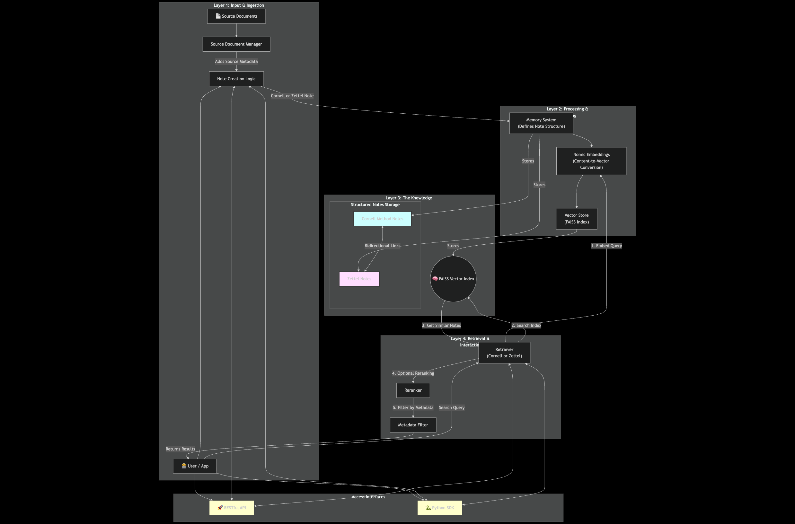

# LLM Memory Agent

An intelligent memory management system that combines Cornell Method note-taking with Zettelkasten principles for organizing and retrieving knowledge from various sources.

## Overview

This system provides a comprehensive solution for capturing, organizing, and retrieving information using two complementary note-taking methodologies:

- **Cornell Method Notes**: Structured notes with cues, main content, and summaries
- **Zettel Notes**: Interconnected atomic notes following Zettelkasten principles

## Key Features

### 🧠 Dual Note-Taking System
- **Cornell Method Notes**: Perfect for structured learning and lecture notes
- **Zettel Notes**: Ideal for building interconnected knowledge graphs
- Seamless linking between both note types

### 🔍 Advanced Retrieval
- Vector-based semantic search using FAISS
- Embedding-powered similarity matching with Ollama embeddings
- Advanced reranking system for improved search quality
- Metadata-based filtering and organization
- Community detection and synthesis note generation

### 📄 Source Document Management
- Support for various document types and sources
- Automatic metadata extraction and management
- Source tracking and attribution for all notes

### 🔗 Knowledge Graph
- Bidirectional linking between notes
- Tag-based organization
- Relationship mapping between concepts

### 🚀 API Interface
- RESTful FastAPI with comprehensive endpoints
- Batch processing capabilities
- Index management with metadata tracking
- Community detection and visualization
- Easy integration with external applications
- Programmatic access to all features

### 📊 Interactive Dashboard
- Streamlit-based graph explorer
- Visual network analysis of note relationships
- Document upload and processing interface
- Real-time community detection visualization

## Architecture

### System Overview



The system follows a layered architecture with four distinct layers:

1. **Layer 1: Input & Ingestion** - Handles source documents through the Source Document Manager
2. **Layer 2: Processing & Memory** - Manages note structures and embeddings with the Memory System
3. **Layer 3: Knowledge Storage** - Stores structured notes and maintains the FAISS vector index
4. **Layer 4: Retrieval & Interface** - Provides search capabilities and user interfaces

### Core Components

1. **Memory System** (`utils/cornell_zettel_memory_system.py`)
   - Cornell Method Note and Zettel Note models with Pydantic
   - Core data structures and relationships
   - LLM-powered note generation and synthesis

2. **Note Processor** (`utils/note_processor.py`)
   - Orchestrates the complete text processing workflow
   - Handles Cornell and Zettel note creation
   - Manages note linking and similarity detection

3. **Retrievers** (`utils/retrievers.py`)
   - FAISS-based vector retrieval with generic typing
   - Specialized retrievers for each note type
   - Advanced search and filtering capabilities
   - Integrated reranking system

4. **Search Reranker** (`utils/search_reranker.py`)
   - Advanced reranking algorithms for improved search quality
   - Configurable scoring mechanisms
   - Performance optimization for large result sets

5. **Community Detector** (`utils/community_detector.py`)
   - Graph-based community detection using NetworkX
   - Multiple algorithms: Louvain, Label Propagation, Girvan-Newman
   - Automatic synthesis note generation for communities
   - Network visualization capabilities

6. **Source Document Manager** (`utils/source_document_manager.py`)
   - Document ingestion and management
   - Metadata extraction and storage
   - Support for multiple document formats via MarkItDown

7. **LLM Integration** (`utils/init_llm.py`)
   - Unified LLM provider interface
   - Support for Ollama and OpenAI models
   - JSON parsing utilities for structured outputs

8. **API Layer** (`api/main.py`)
   - FastAPI with comprehensive RESTful endpoints
   - Batch processing and index management
   - Community detection API
   - Real-time statistics and metadata tracking

9. **Interactive Dashboard** (`dashboard/zettel_graph_explorer.py`)
   - Streamlit-based web interface
   - Visual graph exploration and analysis
   - Document upload and processing
   - Community visualization and management

### Note Types

#### Cornell Method Notes
```python
{
    "id": "unique_identifier",
    "note_simple": {
        "main_note": "detailed notes content",
        "questions": ["key", "questions"],
        "summary": "concise summary"
    },
    "content": "full text representation",
    "zettle_ids": ["linked_zettel_ids"],
    "source_id": "source_document_id",
    "source_title": "source_document_title",
    "created_at": "ISO timestamp",
    "accessed_at": "ISO timestamp",
    "retrieval_count": 0
}
```

#### Zettel Notes
```python
{
    "id": "unique_identifier",
    "note_simple": {
        "title": "note title",
        "keywords": ["relevant", "keywords"],
        "body": "main content",
        "source": "source information"
    },
    "content": "full text representation",
    "type": "standard|synthesis",
    "links": ["connected_note_ids"],
    "tags": ["organizational", "tags"],
    "cornell_id": "linked_cornell_note_id",
    "created_at": "ISO timestamp",
    "accessed_at": "ISO timestamp",
    "retrieval_count": 0,
    "metadata": {"additional": "metadata"}
}
```

## Getting Started

### Installation
```bash
# Clone the repository
git clone <repository-url>
cd llm-memory-agent

# Install dependencies
pip install -r requirements.txt
```

### Basic Usage

#### Using the Note Processor
```python
from utils.note_processor import NoteProcessor
from utils.retrievers import CornellNoteRetriever, ZettelNoteRetriever

# Initialize retrievers
cornell_retriever = CornellNoteRetriever()
zettel_retriever = ZettelNoteRetriever()

# Create note processor
processor = NoteProcessor(
    cornell_retriever=cornell_retriever,
    zettel_retriever=zettel_retriever
)

# Process text into notes
cornell_note, zettel_notes = processor.process_text(
    "Your text content here",
    source_id="doc_123",
    source_title="Document Title"
)

# Search for related content
results = cornell_retriever.search("machine learning concepts", k=5)
```

#### Community Detection
```python
from utils.community_detector import ZettelCommunityDetector

# Initialize community detector
detector = ZettelCommunityDetector(zettel_retriever)

# Generate synthesis notes for communities
synthesis_notes = detector.generate_synthesis_notes(
    min_community_size=3,
    algorithm="louvain"
)

# Visualize the graph
detector.visualize_graph(output_path="communities.png")
```

### API Usage

#### Starting the API Server
```bash
# Install dependencies
pip install -r requirements.txt

# Start the FastAPI server
uvicorn api.main:app --reload
```

#### API Endpoints
The API provides comprehensive endpoints for:
- **Text Processing**: `/process` and `/process_batch` for creating notes
- **Search & Retrieval**: `/search/{index_name}` for semantic search
- **Source Management**: `/source/{index_name}/{source_id}` for source-based queries
- **Index Management**: `/indices` for index statistics and metadata
- **Community Detection**: `/detect_communities` for graph analysis and synthesis

#### Dashboard Usage
```bash
# Start the Streamlit dashboard
streamlit run dashboard/zettel_graph_explorer.py
```

The dashboard provides:
- Interactive graph visualization
- Document upload and processing
- Community detection and analysis
- Real-time search and exploration

## Use Cases
- **Research Management:** Organize academic papers and research notes
- **Learning Systems:** Structure educational content with Cornell Method
- **Knowledge Bases:** Build interconnected knowledge graphs
- **Content Organization:** Manage and retrieve large collections of documents
- **Study Tools:** Create effective study materials with proven note-taking methods

## Testing
Run the test suite:
```bash
# Run all tests
python -m pytest tests/

# Run with coverage
python run_tests.py

# Run specific test files
python -m pytest tests/test_note_processor.py
python -m pytest tests/test_community_detector.py
```

Tests cover:
- Note creation and management (Cornell and Zettel notes)
- Retrieval functionality and search reranking
- Community detection algorithms
- Source document handling
- Note processor workflow
- Configuration management

## Contributing
1. Fork the repository
2. Create a feature branch
3. Add tests for new functionality
4. Ensure all tests pass
5. Submit a pull request